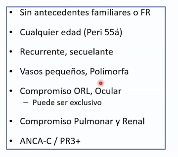

# Anemia megaloblástica

## Introduction

Son un grupo heterogéneo de anemias que se caracterizan por el aumento del tamaño del glóbulo rojo o macrocitosis, asociada a inmadurez nuclear (muerte de precursores en la médula) y eritropoyesis ineficaz. Esto es consecuencia de alteraciones de la síntesis de DNA que inhiben la división nuclear. La maduración asincrónica entre núcleo y citoplasma del eritroblasto produce el megaloblasto donde el citoplasma llega a la madurez, pero el núcleo no.  Por esta alteración en la síntesis de DNA son patologías que se suelen ver acompañadas de la afectación de  otras series hemapoyéticas (cierto grado de leucopenia y trombocitopenia)

Sus causas principales son el déficit de cobalamina (B12) y folato. Menos frecuentes la deficiencia de cobre y efectos adversos de drogas.

## Etiología

**Déficit de Ácido fólico:**

Está presente en alimentos como vegetales, frutas, carne e hígado. Es absorbido en yeyuno y se almacenan unos 5 mg en el hígado, suficientes para unos 3 a 4 meses de uso normal. Su deficiencia está relacionada a disminución de la ingesta en pacientes malnutridos o alcohólicos o en personas con altos requerimientos como embarazo, hemólisis o pacientes en hemodiálisis.

El rol primario del folato es donar grupos metilo en la síntesis de DNA.

El folato se absorbe en duodeno como metiltetrahidrofolato (metil-THF) y pasa a tetrahidrofolato en las células.

**Déficit de B12:**

La cobalamina actúa como cofactor en la reacción que recicla 5-metil-tetrahidrofolato a tetrahidrofolato (THF), la generación de THF está unida a la conversión de homocisteina a metionina. El déficit de B12 hace que el folato quede atrapado en la forma de 5-metil-THF y se asocia a la deficiencia de metionina.

Las principales fuentes de B12 son las carnes, pescado y huevos. Se absorbe gracias al factor intrínseco en el ileon terminal, su reservas hepáticas son de 2 a 3 mg, lo que es suficiente para 2 o 4 años, por lo tanto, es más frecuente el déficit de ácido fólico. Las causas más frecuentes de déficit son anemia perniciosa (anticuerpos anti factor intrínseco), gastrectomía, resección ileal o ileitis, malnutrición (veganos sin uso de B12). Otras causas son Síndrome de Zollinger-Ellison, infecciones por parásitos e insuficiencia pancreática.

**Medicamentos asociados a anemia megaloblástica:**

Alopurinol, Azatioprina, Gadolinio, Leflunomida, Metotrexato, Micofenolato, Cotrimoxazol, agentes quimioterapéuticos y terapia antirretroviral en VIH por nombrar a los más usados.

## Fisiopatología

El problema en estos pacientes es la eritropoyesis ineficaz secundaria a la apoptosis intramedular de precursores hematopoyéticos que resulta por las anormalidades en la generación de DNA. 

Las células precursoras nucleadas en la médula ósea desarrollan núcleos inmaduros o morfológicamente anormales y metamielocitos gigantes, con glóbulos rojos macrocíticos y neutrófilos hipersegmentados en el frotis de sangre periférica. Una deficiencia prolongada conduce a hemólisis intramedular de las células precursoras eritropoyéticas en desarrollo en la médula ósea. La evaluación de laboratorio durante esta fase de la enfermedad revelará hipercelularidad de la médula ósea y evidencia periférica de hemólisis con un recuento bajo de reticulocitos. La fisiopatología detrás de la disfunción neuronal asociada con la anemia megaloblástica no está clara.

En un mielograma, la megaloblastosis se presenta como glóbulos rojos grandes (megaloblastos) y neutrófilos hipersegmentados, los cuales son detectables en un frotis de sangre periférica. La poiquilocitosis y anisocitosis son comunes debido a la eritropoyesis ineficaz. La evaluación de la médula ósea muestra hipercelularidad con maduración y proliferación anormales de los precursores de los glóbulos rojos. Los eritroblastos muestran una falla en la maduración nuclear, manteniendo la cromatina abierta o laxa y un citoplasma maduro normal.

## Manifestaciones clínicas

La anemia puede ser un hallazgo incidental pues se desarrolla gradualmente y los síntomas solo aparecen en casos severos. 

En el déficit de B12 se observan manifestaciones neurológicas como parestesias, dolor neurítico en extremidades inferiores o alteraciones de la marcha. En casos severos pueden aparecen síntomas similares a demencia. Algunos de estos síntomas revierten con terapia, pero algunos pueden no ser complemente reversibles. 

En el déficit de B12 también se puede ver glositis con lengua depapilada, roja y lisa e ictericia por eritropoyesis inefectiva.

## Evaluacion

Se sospecha en anemias arregenerativas macrocíticas con VCM mayor a 100 fL o la aparición de neutrófilos hipersegmentados en el frotis (por alteración en la maduración nuclear). Si el VCM es mayor a 115 fL suele ser más específicos de déficit de B12 o déficit de folato por sobre otras causas. Pero, el VCM normal no descarta anemia megaloblástica.

***Niveles de B12***

Además de anemia macrocítica se puede encontrar ADE elevado por el tamaño heterogéneo de los eritrocitos (anisocitosis), trombocitopenia y leucopenia por lo que puede llegar a causar pancitopenia.

Hay aumento de bilirrubina y LDH por la destrucción de precursores de eritroblastos, la ferritina está normal porque no se alteran los depósitos de hierro.

Siempre medir niveles de ácido fólico y B12 al mismo tiempo.

Unos niveles sobre 300 pg/ml o 221 pmol/L son considerados normales y bajo 200 pg/ml lo hacen sugerente, aunque hay patologías que pueden bajar los niveles de B12 como mieloma múltiple, VIH, embarazo o uso de anticonceptivos. Entre 200 y 300 pg/ml o 148 o 221 pmol/L son considerados límites y van a requerir test adicionales para definir el diagnóstico.

***Niveles de ácido fólico***

Los niveles bajo 2 ng/ml se consideran deficiencia. 2 - 4 mg/dl se consideran limite.

***Estudio en caso de alteraciones límites***

En caso de sospecha de déficit de B12 se debe solicitar niveles de ácido metilmalónico y homocisteina que deberían aumentar. En el caso de déficit de folato solo aumenta la homocisteína.

En pacientes con déficit de B12 confirmado, se debe pedir anticuerpo anti factor intrínseco para descartar anemia perniciosa.

## Tratamiento

Se pueden dar vía oral o parenteral, se prefiere vía oral cuando no existe malabsorción y no hay síntomas graves. La duración del tratamiento dependerá de la causa de anemia y si es corregible. 

En casos graves es necesario el uso de transfusiones.

***Déficit de B12:***

La dosis es de 1 mg por vía parenteral una vez a la semana hasta corregir la deficiencia, seguida de dosis de mantenimiento mensuales  o bimestrales. También se puede dar por vía oral.

En 1 a 2 meses debería mejorar la anemia y los síntomas de hemólisis intramedular. Sin embargo, los síntomas neuropsiquiátricos tardan más en recuperarse (de 3 a 12 meses) y, según algunos informes, hay un empeoramiento clínico transitorio de los síntomas neurológicos.

***Déficit de ácido fólico***

Se recomienda 1 a 5 mg al día.

No se debe dar si no está claro el déficit específico, su uso puede empeorar los síntomas neurológicos de déficit de B12.

**Referencias:**

StatPearl 2023

San Miguel. Hematología, Manual Basico razonado, 3ra Ed.